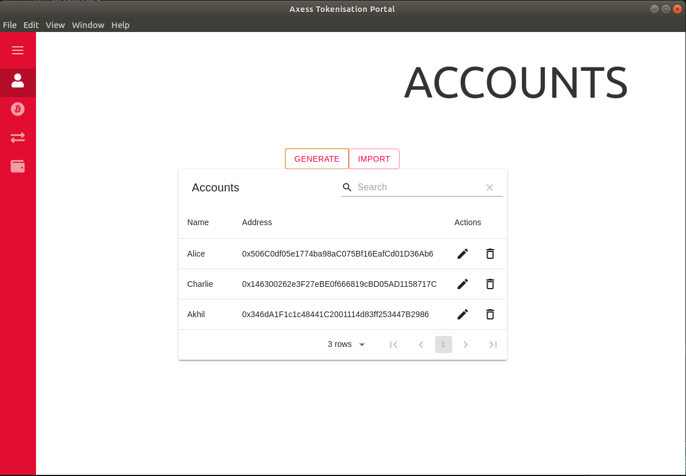
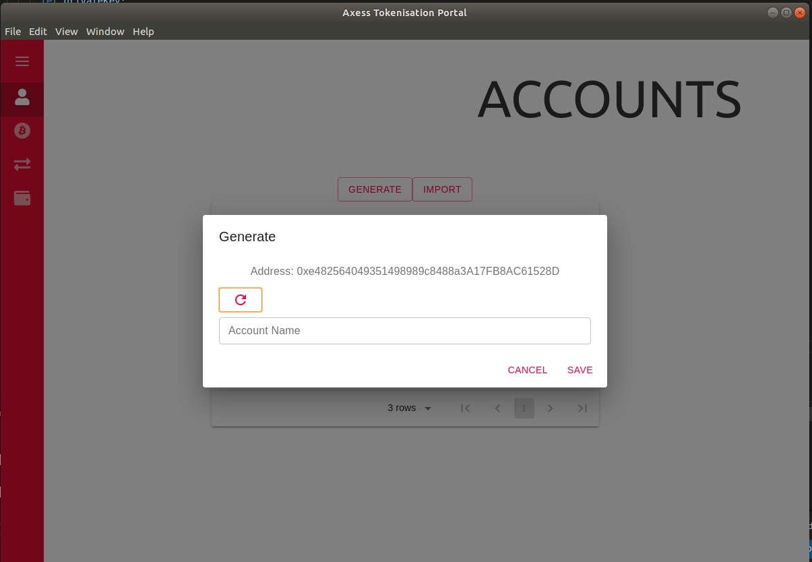
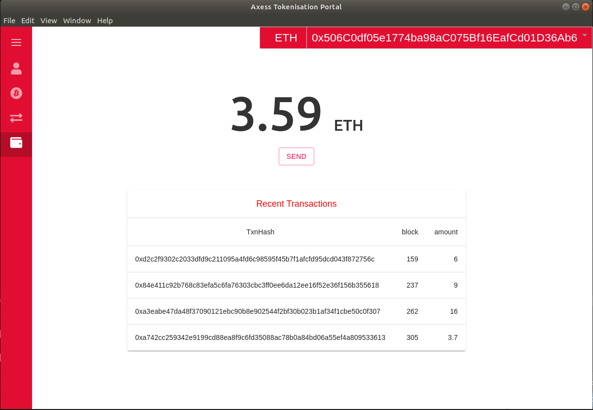
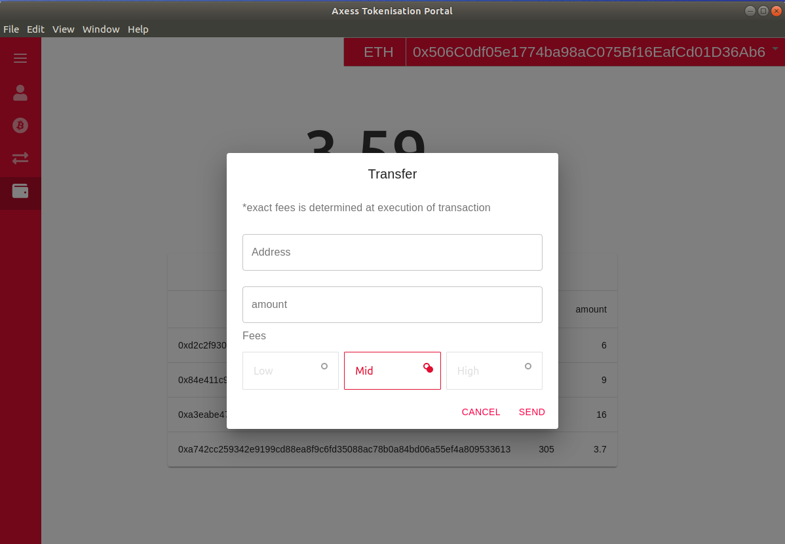
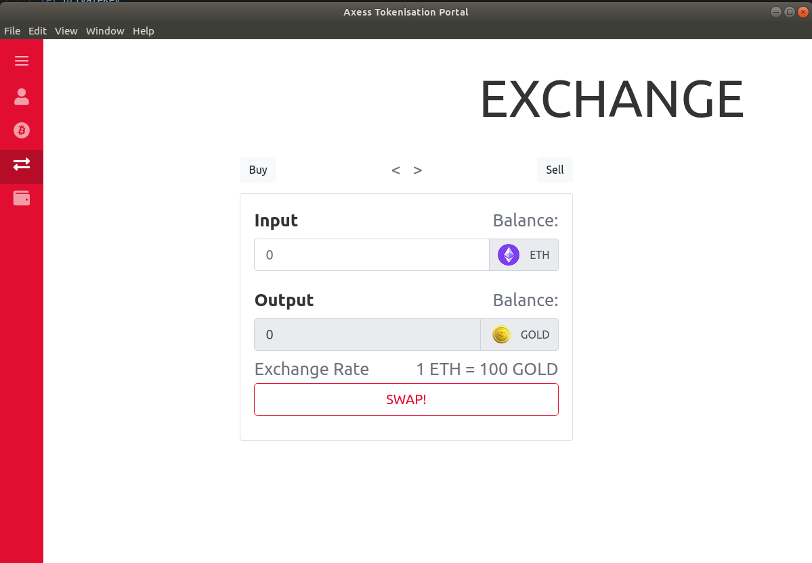

# Dapp Store
A digital asset wallet, Use it to create, send and deploy tokens on ethereum network

## Account

**Generating a new account**

## Wallet

**transfer tokens**

## Exchange



## Deploy to Desktop
1. Run the build process
```
npm run build
```
2. Go into your project folder using your file explorer. Navigate to the `dist` folder and open it. Then double-click `<your-project-name>` Setup 0.1.0. Your app should open and there should now be an icon on your desktop for this app.

**Use a Custom Icon**

Add a 256 x 256 .png or .ico image in your public folder. It should be either `icon.ico` or `icon.png`. Update the `icon` property in your `package.json` if necessary. Currently, it uses an image called `icon.png`, which is a graphic of a coffee cup. You'll only see this in production. For more info, see the [electron-builder documentation](https://www.electron.build/icons)


